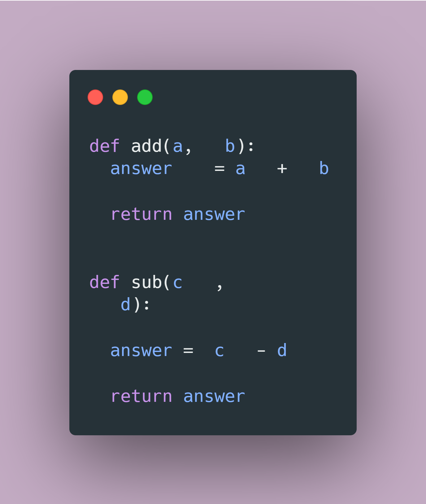
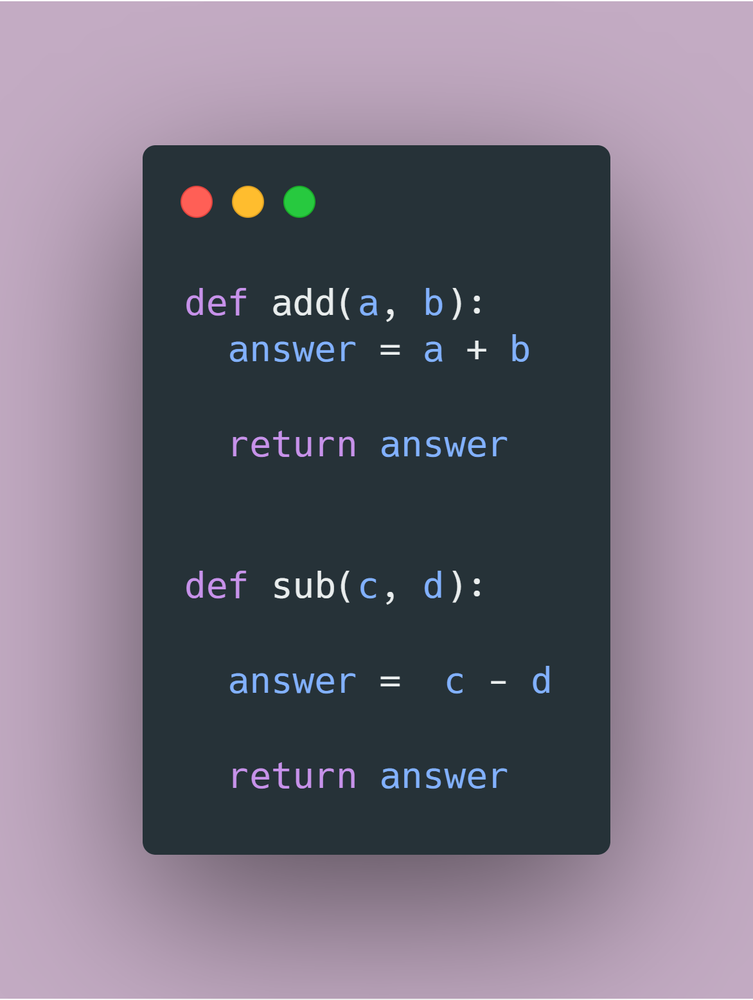

# One shot destination for Facts of the day posts

## Fact 1:

In modern software development, code readability is an essential part. Code formating is one of the things that ensure your software can be easily read by other developers. While traditionally we use to manually do this from fixing indentations to writing comments in separate line, a Python extenstion called `Black` automates the entire task for your project lifecycle!

#### Before

#### After

[Reference](https://black.readthedocs.io/en/stable/pyproject_toml.html#what-on-earth-is-a-pyproject-toml-file)
